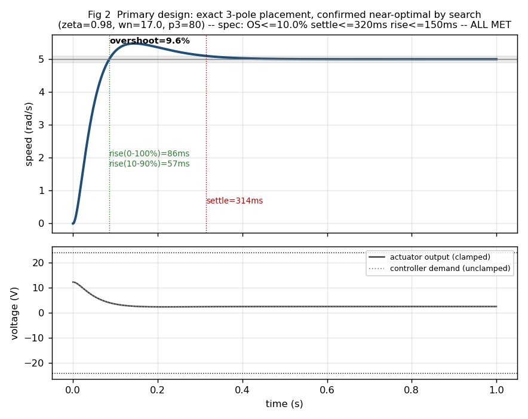
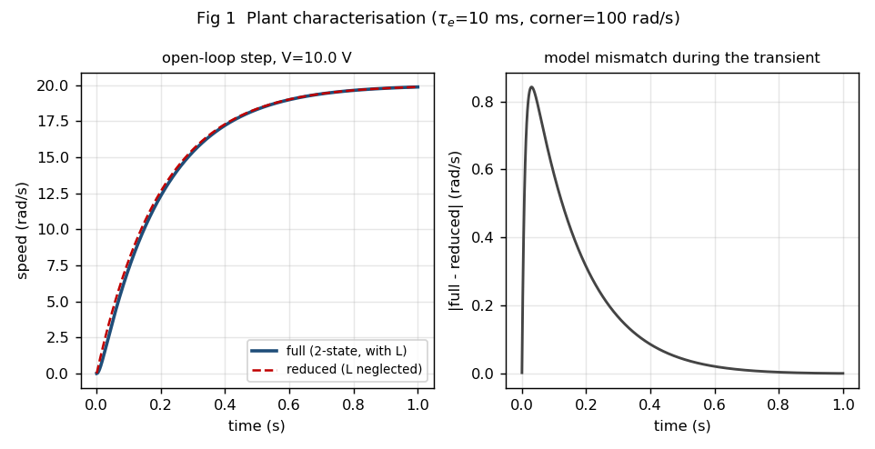
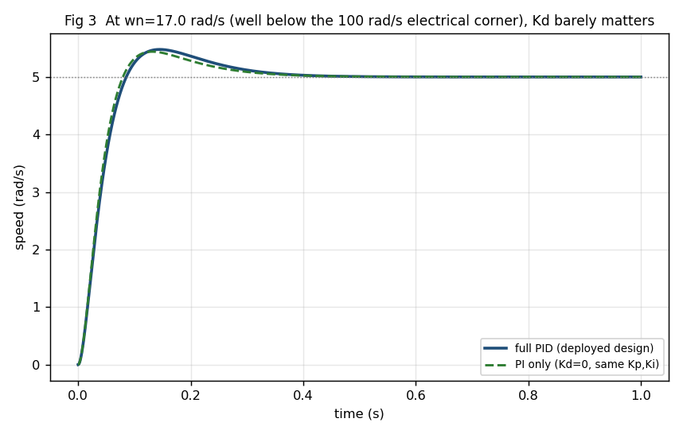
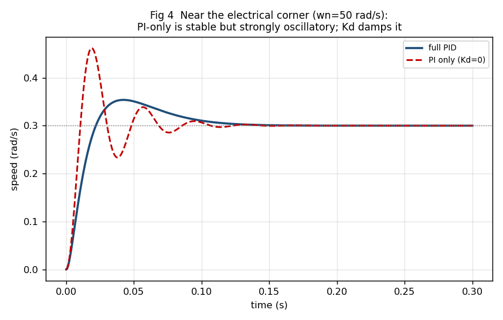
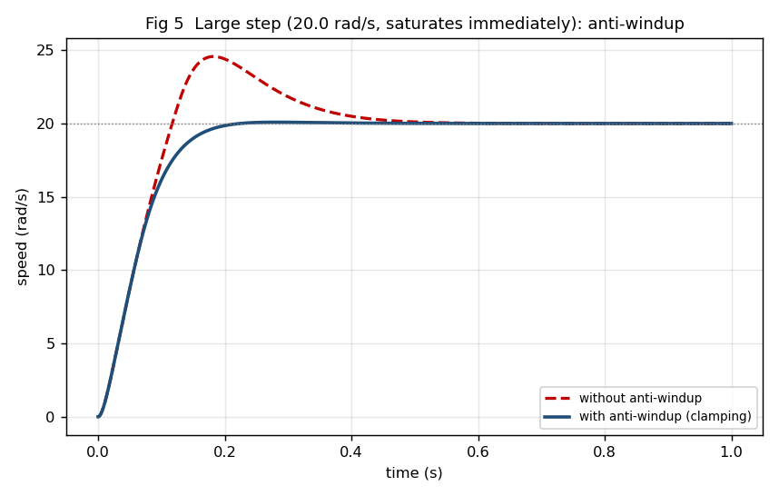
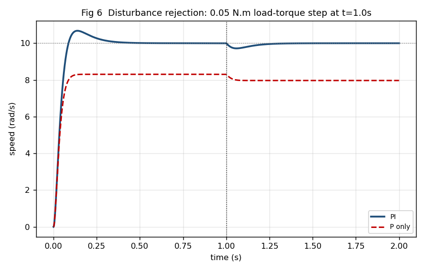

<div align="center">

# PID Gain Tuning for DC Motor Speed Control

**A simulation study for fast, stable, and practical motor speed control**

[](https://python.org)
[](https://numpy.org)
[](https://matplotlib.org)

[Project Repository](https://github.com/Agrawaladarsh524/PID_Controller) • [Run Locally](#-run-locally) • [View Results](#-key-results)

</div>

---

## 📖 About The Project

This project explores the design and tuning of a Proportional-Integral-Derivative (PID) controller for regulating the speed of a DC motor. Using a full electromechanical model that includes both mechanical inertia and electrical inductance, the simulation demonstrates how to accurately tune a PID controller to meet strict performance targets (like overshoot and settling time). 

By implementing an automated grid search and exact pole placement, the project achieves an optimal balance between fast response times and actuator limits. It is a pure software simulation designed to teach and demonstrate practical control theory concepts, such as anti-windup clamping and the real-world effects of derivative action.

> **Note:** The motor parameters used here are representative of a typical small permanent-magnet DC motor and are purely for simulation purposes.

---

## 🎯 Project Snapshot

The controller was meticulously tuned to achieve specific targets when given a `5 rad/s` speed step command.

### Performance Results

| Metric | Target Goal | Achieved Result |
| :--- | :---: | :---: |
| **Overshoot** | `<= 10%` | **9.57%** ✅ |
| **Settling Time** (2% band) | `<= 320 ms` | **314.2 ms** ✅ |
| **Rise Time** (0-100%) | `<= 150 ms` | **85.6 ms** ✅ |
| **Peak Voltage Demand** | `<= 24 V` | **12.3 V** ✅ |

### Optimized Gains

The grid search yielded the following optimal PID gains:

```python
Kp = 2.4546    # Proportional Gain
Ki = 23.1200   # Integral Gain
Kd = 0.00932   # Derivative Gain
```

*The selected design stays comfortably below the `24 V` actuator limit and is within `4.6%` of the absolute fastest feasible design found.*

---

## 📈 Key Results

<div align="center">
  
  <p><em>Primary design: All three response targets are successfully met without saturating the motor voltage.</em></p>
</div>

### Detailed Analyses

<table align="center">
  <tr>
    <td align="center"></td>
    <td align="center"></td>
  </tr>
  <tr>
    <td align="center"><b>Plant Model</b><br>Armature inductance noticeably alters the transient response.</td>
    <td align="center"><b>PID versus PI</b><br>At lower bandwidths, a simple PI controller performs just as well.</td>
  </tr>
  <tr>
    <td align="center"></td>
    <td align="center"></td>
  </tr>
  <tr>
    <td align="center"><b>When Kd Matters</b><br>At higher bandwidths, the Derivative term slashes overshoot from 54% down to 18%.</td>
    <td align="center"><b>Anti-Windup Effectiveness</b><br>Voltage clamping drastically reduces overshoot (from 23% to 0.5%) during saturation.</td>
  </tr>
  <tr>
    <td colspan="2" align="center"></td>
  </tr>
  <tr>
    <td colspan="2" align="center"><b>Disturbance Rejection</b><br>The Integral term effectively removes steady-state error when a constant load torque is applied.</td>
  </tr>
</table>

---

## ⚙️ How It Works

### The Plant Model
The simulation uses a full, two-state motor model tracking both electrical current (`i`) and mechanical speed (`w`):

```math
L \frac{di}{dt} = V - R i - K_e w
```
```math
J \frac{dw}{dt} = K_t i - B w - T_{load}
```

### The Controller Design
The PID controller uses a **derivative-on-measurement** approach. By differentiating the measured speed rather than the error signal, we completely avoid a massive "derivative kick" when the reference speed suddenly changes.

The optimization process:
1. Places a dominant pole pair along with a fast real pole.
2. Calculates exact `Kp`, `Ki`, and `Kd` values using coefficient matching.
3. Conducts a grid search to test combinations.
4. Accepts designs that meet all physical constraints (like the `+/- 24V` limit) and timing targets.
5. Implements **conditional integration (anti-windup)** to stop the integral term from accumulating wildly when the motor hits its voltage limit.

---

## 🚀 Run Locally

Want to try tuning the motor yourself? Clone the repo and run the scripts:

```bash
# 1. Install dependencies
python -m pip install -r requirements.txt

# 2. Run the simulation and self-tests
python dc_motor_pid.py

# 3. Generate the response plots
python make_plots.py
```

*Running the plot script will automatically refresh the figures in the `images/` directory and update `results.txt`.*

---

## 📁 Project Structure

| File | Description |
| :--- | :--- |
| `dc_motor_pid.py` | The core simulation engine, PID controller logic, grid search, and test scenarios. |
| `make_plots.py` | Utility script to generate and save all visual results. |
| `images/` | Directory containing the six auto-generated response plots. |
| `results.txt` | Text output containing the detailed numerical test results. |
| `requirements.txt` | Required libraries (`numpy`, `matplotlib`, `scipy`). |

---

## ⚠️ Limitations

While highly accurate, this simulation makes a few simplifications:
- Only **voltage saturation** is enforced; physical current or torque limits are not modeled.
- Motor parameters are considered nominal; robustness against uncertainty is outside the scope.
- Non-linear real-world effects like stiction, sensor noise, signal quantization, and magnetic saturation are excluded.
- The controller is simulated as a continuous-time system, rather than a discrete fixed-rate digital controller.
- Uses a single speed loop instead of the cascaded (current + speed) loops typically found in commercial drives.
